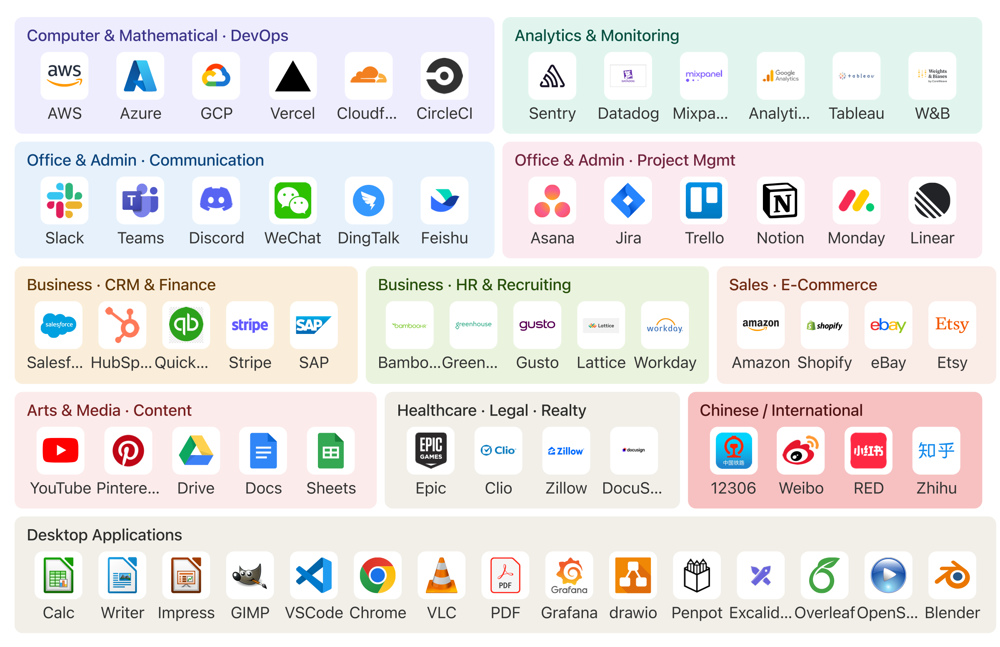

# CUA-Gym-Hub

<div align="center">

[](LICENSE)
[](https://github.com/xlang-ai/CUA-Gym-Hub)
[](https://github.com/xlang-ai/CUA-Gym)

</div>

> **Research use only.** All third-party product names, logos, and trade
> dress referenced in this repository remain the property of their
> respective owners. Mocks display deliberately altered brand names in
> their UI (e.g., "Xmail" rather than "Gmail"). See
> [TRADEMARKS.md](TRADEMARKS.md) for the full notice and our 7-day
> takedown policy.

CUA-Gym-Hub is a suite of **98 self-contained mock web applications** built as RL training environments for computer-use agents, and is included as a submodule of [CUA-Gym](https://github.com/xlang-ai/CUA-Gym).

Each mock is a production-quality React SPA that faithfully replicates the UI and interactive behavior of a real commercial product — without authentication, network calls, or external dependencies. All state is local, inspectable, and resettable via a unified HTTP API, making every mock a deterministic, reproducible sandbox for agent training.

<p align="center">
  
</p>

## Why This Works

Two coupled design choices make every mock in CUA-Gym-Hub usable as an RL training environment — not just a pretty UI fixture:

**1) State injection.** When a task is created, the synthesis pipeline ships a JSON initial state alongside its `reward.py` and POSTs it to the mock. Loading `?sid=<task_id>` then renders that exact world — emails, project boards, calendars, customer tickets, whatever the task description calls for. **A single mock can host arbitrarily many distinct task worlds with no code change**, which is what lets one `gmail_mock` serve dozens of triage / search / drafting / cross-app workflows.

**2) Session isolation.** Every URL carries its own session id. State files, uploads, and resets are all namespaced under `.mock-states/<sid>.json` on the server. **Parallel RL workers training on the same mock never see one another's mutations** — a critical property for distributed rollouts where hundreds of episodes run concurrently against a shared pool of mock backends. Each episode resets cleanly with a single `POST`.

The [State API](#state-api) section below documents the contract; the [SANDBOX_COMPLETENESS_GUIDE.md](SANDBOX_COMPLETENESS_GUIDE.md) defines the acceptance bar every mock is held to.

## Mock Quality Bar

Beyond the two contract guarantees above, every mock app is held to the following standards (see [SANDBOX_COMPLETENESS_GUIDE.md](SANDBOX_COMPLETENESS_GUIDE.md) for the full criteria):

- **No dead affordances.** Every visible button, menu, and control must do something coherent. Computer-use agents click everything; placeholder behavior breaks training.
- **State is inspectable.** All user-visible mutations persist through local state and are exposed via `/go?sid=...` as `{initial_state, current_state, state_diff}`. RL reward functions consume this diff.
- **File interactions are first-class.** Upload, download, import, export, and attachment flows are implemented with real browser file APIs, not stubs.
- **No external calls.** Collaboration features (share dialogs, notifications, version history) are implemented as local analogs. The mock never touches the network at runtime.

## Architecture

Every mock follows the same structure:

```
websites/
└── <app>_mock/
    ├── src/
    │   ├── App.jsx                    # React Router routes, preserves ?sid= through navigation
    │   ├── context/AppContext.jsx     # Global state (Context / Redux / Zustand)
    │   ├── utils/dataManager.js       # Session init, localStorage helpers, server sync
    │   ├── utils/stateTracker.js      # Flat diff computation for /go endpoint
    │   ├── components/                # Reusable UI components
    │   └── pages/                     # Route-level page components
    ├── vite.config.js                 # Vite build config + state API middleware plugin
    ├── package.json
    ├── SCHEMA.md                      # State schema + Observable State Changes table
    └── index.html
```

**Technology:** React 18 · React Router 6 · Vite 5 · localStorage persistence · file-based server state (`.mock-states/`)

## State API

Every mock exposes the same HTTP API. In dev mode (`npm run dev`) and in production preview (`npm run preview`), the endpoints are registered by a Vite plugin in `vite.config.js`:

| Endpoint | Method | Body / Response |
|----------|--------|-----------------|
| `/post?sid=<sid>` | POST | `{"action":"set","state":{...}}` — set initial + current state |
| `/post?sid=<sid>` | POST | `{"action":"set_current","state":{...}}` — update current only, preserve initial |
| `/post?sid=<sid>` | POST | `{"action":"reset"}` — restore current to initial |
| `/go?sid=<sid>` | GET | `{initial_state, current_state, state_diff}` |
| `/state?sid=<sid>` | GET | `{stored_state, has_custom_state, sid}` |
| `/upload?sid=<sid>` | POST | multipart/form-data → `{files:[{url, original_name, stored_name, size}]}` |
| `/files/<sid>/<filename>` | GET | Serves uploaded file with correct Content-Type |

**Session isolation:** `sid` is sanitized and used to namespace state files under `.mock-states/<sid>.json`. No sid → uses a shared default state. Each training episode should use a unique `sid` (e.g. task ID) to avoid cross-episode contamination.

**State diff** is a flat key-path object computed by the server on every `/go` call. RL reward functions use the diff to detect whether the agent completed the task (e.g. `messages[C001]` grew by one entry after a "send message" task).

**Example:**
```bash
# Inject initial state before the agent episode
curl -X POST "http://localhost:5173/post?sid=task_042" \
  -H "Content-Type: application/json" \
  -d '{"action":"set","state":{"currentUser":{"id":"U001","name":"Alice"},"channels":[...]}}'

# After agent rollout — inspect what changed
curl "http://localhost:5173/go?sid=task_042"
# → {"initial_state":{...}, "current_state":{...}, "state_diff":{"messages.C001":[...]}}

# Reset for the next episode
curl -X POST "http://localhost:5173/post?sid=task_042" -d '{"action":"reset"}'
```

Each mock's `SCHEMA.md` documents the full state schema and an **Observable State Changes** table that maps user actions to the state fields they affect — the primary reference for writing reward functions.

## Mock Applications (98)

**Communication & Social (18)**
`discord` · `dingtalk` · `facebook` · `feishu` · `gmail` · `instagram` · `linkedin` · `microsoft_teams` · `outlook_web` · `pinterest` · `reddit` · `slack` · `twitter` · `wechat` · `weibo` · `xiaohongshu` · `zhihu` · `zoom_web`

**Productivity & Documents (16)**
`airtable` · `asana` · `canva` · `canvas` · `Canvas-LMS` · `confluence` · `google_calendar` · `google_docs` · `google_drive` · `google_sheets` · `jira` · `lattice` · `linear` · `lucidchart` · `miro` · `monday` · `notion` · `openreview` · `trello`

**Development & Cloud (12)**
`aliyun` · `aws_console` · `azure` · `circleci` · `cloudflare` · `datadog` · `github` · `gitlab` · `postman` · `sentry` · `vercel` · `wandb`

**E-commerce & Travel (11)**
`amazon` · `amazon_seller` · `booking_com` · `ebay` · `expedia` · `instacart` · `shopify_admin` · `taobao_seller` · `tripadvisor` · `uber_eats` · `woocommerce`

**Finance & Enterprise (20)**
`adp` · `bamboohr` · `clio` · `coinbase` · `contractbook` · `docusign` · `Expensify` · `greenhouse` · `gusto` · `hubspot` · `hubspot_marketing` · `paypal` · `quickbooks` · `robinhood` · `salesforce` · `SAP` · `ServiceNow` · `stripe_dashboard` · `TradingView` · `workday`

**Analytics & Marketing (10)**
`amplitude` · `google_ads` · `google_analytics` · `hotjar` · `klaviyo` · `looker_studio` · `mailchimp` · `meta_ads` · `mixpanel` · `tableau`

**Other (9)**
`12306` · `epic-health` · `google_flights` · `PACS-viewer` · `westlaw` · `youtube` · `Zendesk` · `zillow` · `tripadvisor`

## Quick Start

**Run a single mock:**
```bash
cd websites/notion_mock
npm install
npm run dev        # → http://localhost:5173
```

**Build for production preview** (activates `configurePreviewServer` — required for the state API to work in built mode):
```bash
npm run build
npm run preview    # → http://localhost:4173
```

**Deploy all 98 mocks on one server** (requires Node.js ≥ 18, tmux):
```bash
./deploy-all.sh                            # install + build + start all
./deploy-all.sh --skip-install             # skip npm install
./deploy-all.sh --skip-build --no-attach  # skip rebuild, run in background
```

See [DEPLOY.md](DEPLOY.md) for port assignments, reverse proxy setup, and integration with the OSWorld task runner.

## Multi-Agent Development Pipeline

Each mock was built using a coordinated team of Claude Code agents defined in `.claude/agents/`:

| Agent | Role |
|-------|------|
| `orchestrator` | Drives the dev loop; coordinates all other agents; never writes code |
| `plan` | Web research + screenshot analysis → `TODO.md`, `DESIGN.md`, `assets/` |
| `dev` | Implements all source code; resolves `AUDIT.md` and `TEST.md` issues |
| `audit` | Detects dead handlers, untracked state, missing `/go` coverage; writes `SCHEMA.md` |
| `playwright` | Browser-tests every interactive element on every route; writes `TEST.md` bug reports |

<p align="center">
  
</p>

The orchestrator runs up to 10 rounds of `dev → audit → playwright` until all of these are true:
- Every P0 and P1 item in `TODO.md` is `[x]`
- `AUDIT.md` has zero P0 issues
- `TEST.md` has zero P0/P1 bugs
- `SCHEMA.md` documents all observable state changes
- `npm run build` passes

To build a new mock app using the same pipeline, invoke the orchestrator agent from this repository in Claude Code:

```
Build a new mock for Figma with full state API support.
```

## Contributing

See [SANDBOX_COMPLETENESS_GUIDE.md](SANDBOX_COMPLETENESS_GUIDE.md) for design principles and acceptance criteria.

## Citation

If you use CUA-Gym-Hub in your research, please cite the CUA-Gym paper:

```bibtex
@misc{wang2026cuagymscalingverifiabletraining,
      title={CUA-Gym: Scaling Verifiable Training Environments and Tasks for Computer-Use Agents},
      author={Bowen Wang and Dunjie Lu and Junli Wang and Tianyi Bai and Shixuan Liu and Zhipeng Zhang and Haiquan Wang and Hao Hu and Tianbao Xie and Shuai Bai and Dayiheng Liu and Que Shen and Junyang Lin and Tao Yu},
      year={2026},
      eprint={2605.25624},
      archivePrefix={arXiv},
      primaryClass={cs.AI},
      url={https://arxiv.org/abs/2605.25624},
}
```

## License

[Apache 2.0](LICENSE) · Part of [CUA-Gym](https://github.com/xlang-ai/CUA-Gym)
